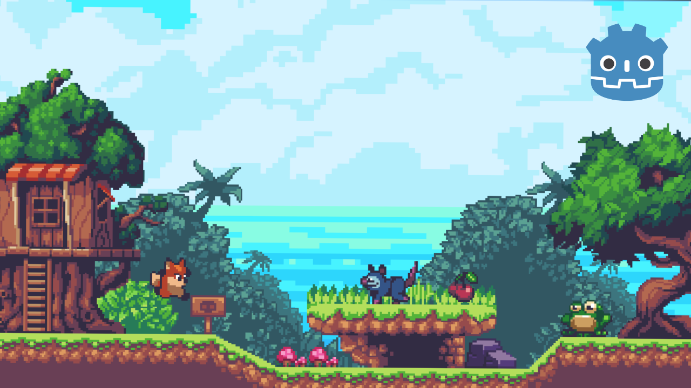

# **Sunny Land Adventure**  
  

**Sunny Land Adventure** is a 2D platformer game built using the Godot Engine. The game features connected levels, enemies with basic AI, collectibles, and a progression system where the player advances to the next level by reaching home.  

---

# Gameplay Video  
Click the thumbnail to watch the video on YouTube :

## **Table of Contents**
1. [Features](#features)
    - [Player Abilities](#player-abilities)
    - [Enemies](#enemies)
    - [Levels](#levels)
    - [Interface & GUI](#interface--gui)
2. [How to Get Started](#how-to-get-started)
3. [Controls](#controls)
4. [Development Details](#development-details)
5. [Contribution](#contribution)

---

## **Features**

### **Player Abilities**  
The player controls a basic platformer character with the following abilities:  
- **Jumping:** Navigate platforms and overcome obstacles.  
- **Enemy Stomping:** Defeat enemies by stomping on them.  
- **Hit Detection:** Detect collisions with enemies or obstacles.  
- **Collectibles:** Pick up coins and cherries to earn points and gain extra lives.  

### **Enemies**  
The game includes two types of enemies with simple AI mechanics:  
- **Frog:**  
  - Patrols and chases the player upon detection.  
  - Returns to its idle state when the player moves out of range.  
- **Opossum:**  
  - Patrols the area and pursues the player when detected.  
  - Avoids environmental hazards like spikes.  

### **Levels**  
- Multiple interconnected levels with increasing difficulty.  
- Earn points for defeating enemies (Frog and Opossum).  
- Progression system: Reach the "home" to advance to the next level.  

### **Interface & GUI**  
- **Coin and Health Counter:** Displays the player’s current stats.  
- **Main Title Screen:** A polished and intuitive start menu.  
- **Level Transitions:** Smooth fade-in effects between levels for a better user experience.  

---

## **How to Get Started**

Follow these steps to set up and play the game:  

1. **Download the Godot Engine:**  
   Download and install the [Godot Engine](https://godotengine.org/) (version 4.0 or higher).  

2. **Download the Project Files:**  
   Clone this repository.  

3. **Open the Project in Godot:**  
   Open the Godot Engine, click on "Import Project," and select the project file where you cloned it.  

4. **Run the Game:**  
   Use the play button in Godot to launch the game and start playing!  

---

## **Controls**

- **Move:** `W`, `A`, `S`, `D` or Arrow Keys  
- **Jump:** `Spacebar`  

---

## **Development Details**

- **Engine:** The game was developed using the Godot Engine (version 4.0+).  
- **Programming Language:** GDScript was used for all game logic.  
- **Design Concepts:** This project focuses on showcasing the use of **Inheritance** and **Composition (Components)** to build better and modular game mechanics.  

### **Key Features Implemented**
- Basic AI for enemies (chase and patrol behavior).  
- Level transition mechanics.  
- Coin and health counters for an interactive UI.  
- Polished gameplay with smooth player-enemy interactions.  

---

---

## **Contribution**

It’s just me only. I developed the game as a solo effort and I already informed about it. 

---

